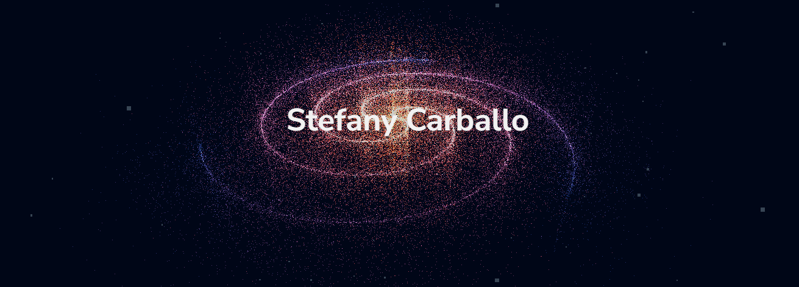

# Demo

- [https://stefanygeraldine.github.io/threejs-scroll-animation/](https://stefanygeraldine.github.io/threejs-scroll-animation/)

# React Three.js Scroll Animations and Parallax Effects

This project is a modern web application built with React and Vite, incorporating Three.js for 3D graphics. The application leverages scroll animations and parallax effects to create an engaging and interactive user experience.

## Technologies Used

- **React**: A JavaScript library for building user interfaces, facilitating the creation of reusable UI components.
- **Vite**: A build tool that provides a faster and leaner development experience for modern web projects.
- **Three.js**: A JavaScript library for creating and displaying animated 3D graphics in the browser.
- **GSAP (GreenSock Animation Platform)**: A powerful library for creating high-performance animations.

## Key Features

1. **3D Graphics with Three.js**
    - Integration of Three.js to render 3D models and scenes.
    - Utilization of WebGL for high-performance graphics rendering.

2. **Scroll Animations**
    - Implementation of smooth scroll animations using GSAP.
    - Triggering animations based on the user's scroll position for dynamic content presentation.

3. **Parallax Effects**
    - Creation of parallax scrolling effects to provide depth and a more immersive browsing experience.
    - Use of layered images and content that move at different speeds when scrolling.
